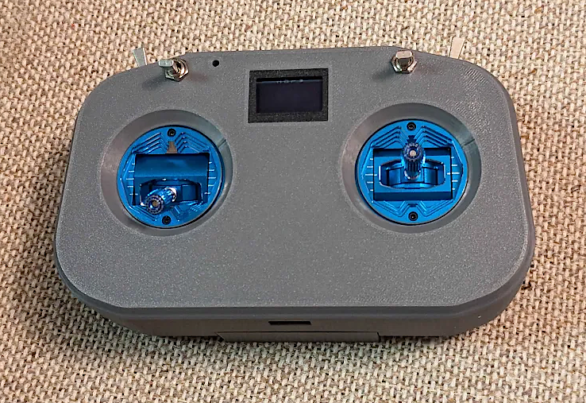
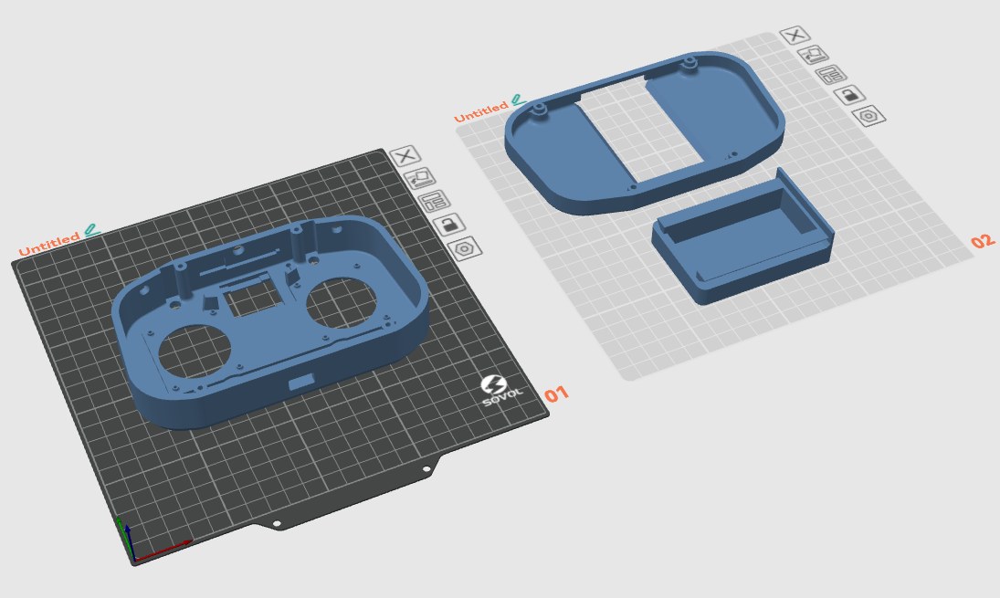
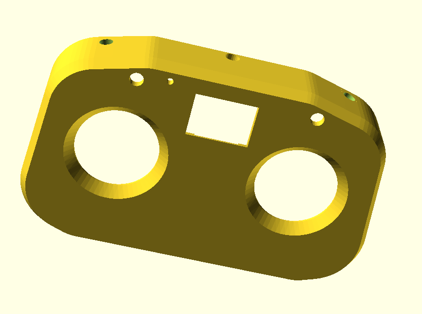
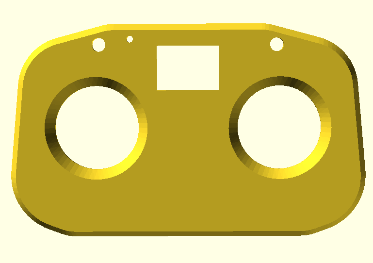
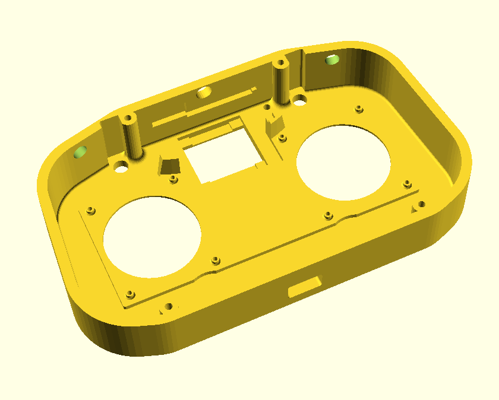

# Arduino RC (Remote Control) Transmitter Handset

* Purpose:
  - This 3d printable shell and Arduino source code will let you build your own RC transmitter for planes, quadcopters, rovers, boats, robots, etc.

* Hardware needed:
  - Radiomaster zorro-sized AG01 mini; or zorro-sized style plastic gimbals (zorro is a model of radiomaster brand transmitter handset)
  - elrs serial receiver (as normally used in a quadcopter, etc); but flashed with 'rx as tx' firmware
  - Arduino nano (atmega 328) cpu; but could also be most any cpu
  - various switches
  - optional oled .96" i2c display
  
* Software:
  - Arduino source is included
  - This is experimental in nature; do not trust this until you personally verify it.  I'm considering this alpha quality, until I also get more experience with this code base.
  - Arduino older style is enough to build/flash this.  Newer style and PIO may also (should) work.

* 3D print STL files in the stl folder
  

* Based on work from (not a full list, if I missed you, please let me know):
  - https://github.com/kkbin505/Arduino-Transmitter-for-ELRS
  - https://github.com/dbloemhard/Arduino-Transmitter-for-ELRS3.x
  - https://github.com/cruwaller/elrs_handset
  - https://www.thingiverse.com/thing:6677484
      - The thingiverse 'TinyTX' has some of the best instructions for building this circuit.  Its the same circuit.

* Views of the 3d printable:
  

